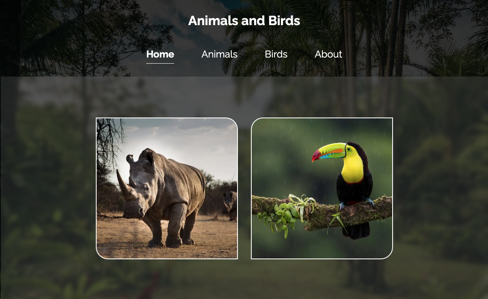
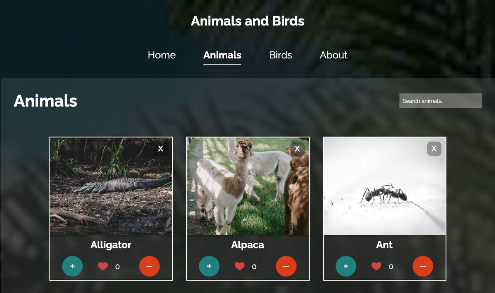
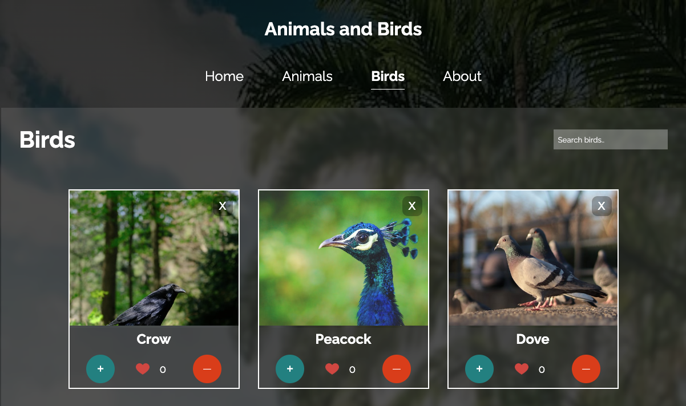

# Animal and Bird Cards on React

## This is a classroom project for Fullstack Web Developer Program (React & Node) in BCH, Helsinki 2022.

The purpose of this project is to learn 'list and keys' through external JavaScript objects data fetching. Additionally, This project version focuses on React Router, page navigation without page reloading.

User can remove and filter cards.

## Screenshots

### Screenshot 1

### Screenshot 2

### Screenshot 3

#### Happy browsing &nbsp;🦏&nbsp;🦜&nbsp;...
